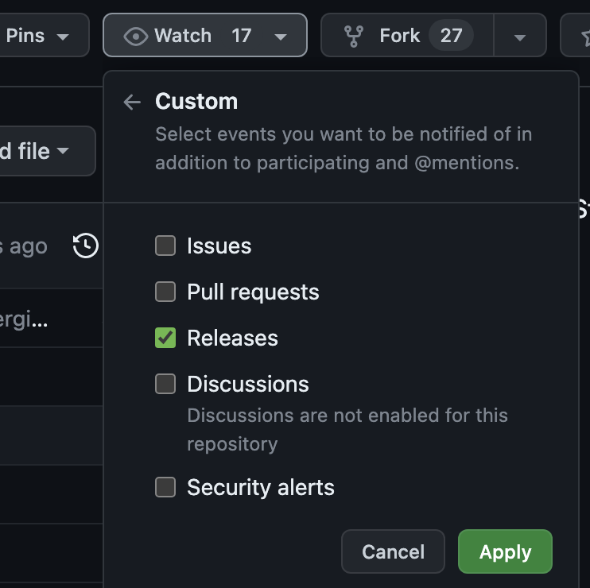

# Release Notes
Release Notes for **DataStax** Products

## How to get alerted of new releases?
1. Ensure you are [signed into GitHub](https://docs.github.com/en/get-started/onboarding/getting-started-with-your-github-account).
2. Navigate to https://github.com/datastax/release-notes/tree/master
3. Click `Watch`.
4. Click `Custom`.
5. Check `Releases`.
6. Hit `Apply`.

Voila! ✨ You'll now automatically get notified on the email attached to the GitHub ID used above for any new releases.

---